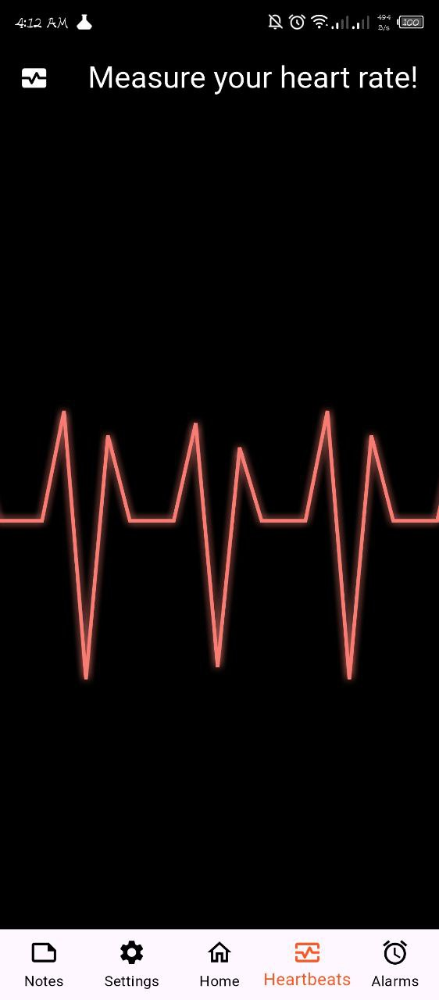
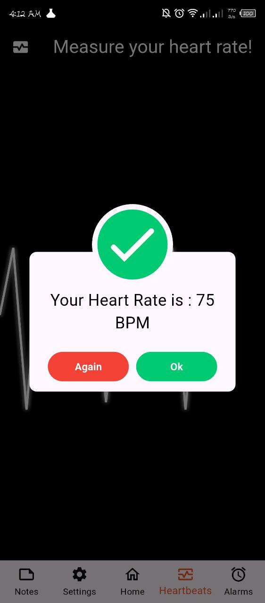
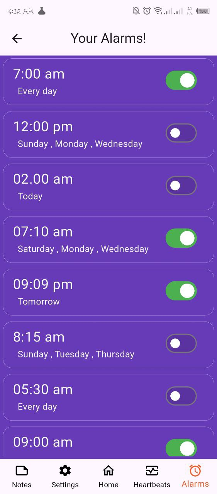

# ⏰ CortWatch App

A **cross-platform health companion application** built using **Flutter** for both **mobile** and **Windows desktop**.  
The app provides essential health and lifestyle tools including heart rate monitoring, alarms, calendar scheduling, and calories tracking — designed to help users stay organized and focused on their well-being.

---

## 📱 Features

- ❤️ Heart rate monitoring
- 🕰 Clock with alarms
- 📆 Calendar scheduling (with Syncfusion Calendar)
- 🔥 Calories tracking with visual indicators
- 🪟 Supports **both mobile and Windows desktop**
- 🎨 Clean and consistent UI with responsive design

---

## 🛠 Tech Stack

- **Flutter**
- **Dart**
- **Flutter Desktop Support**
- 
---

## 📦 Packages Used

| Package                        | Purpose                            |
|--------------------------------|------------------------------------|
| `flutter_screenutil`           | Responsive design                   |
| `rename_app`                   | Change app name / ID easily          |
| `path`                         | Handle file system paths             |
| `percent_indicator`            | Circular & linear progress indicators |
| `awesome_dialog`               | Animated and styled dialogs          |
| `syncfusion_flutter_calendar`  | Calendar UI and scheduling           |

---

## 🚀 How to Run

```bash
# 1. Clone the repository
git clone https://github.com/iahmedmostafa/cortwatch.git
cd cortwatch

# 2. Install dependencies
flutter pub get

# 3. Run on Mobile / Desktop
flutter run
```

📸 Screenshots:







## License:
This project is licensed under the MIT License - see the LICENSE file for details.

## Developed by
Ahmed Mostafa
GitHub: [@iahmedmostafa](https://github.com/iahmedmostafa)
